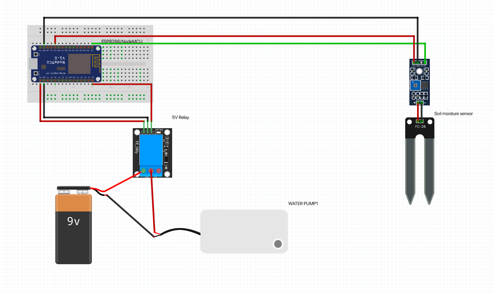

# Smart farming with Raspberry pi
Course project for CSC275 (CSUS).

This repo is organized as below
```bash
├── node_mcu_code               #Code that is uploaded to NODE-MCU(ESP8266)
│   ├── chilli-esp8266
│   │   └── chilli-esp8266.ino  #Code that is uploaded to NODE-MCU(ESP8266) in chilli pot
│   └── tomato-esp8266
│       └── tomato-esp8266.ino  #Code that is uploaded to NODE-MCU(ESP8266) in tomato pot
├── python_mqtt_client 
│   └── mqtt_client.py          #MQTT python client that is running on raspberry-pi and listening to messages from Nodes
├── README.md
└── webserver                   #All files that are responsible for creating Web dashboard
    ├── bootstrap.min.css       #CSS downloaded from web (Not claiming ownership)
    ├── chilli.jpeg             #Jpeg downloaded from web (Not claiming ownership)
    ├── index.html
    ├── index.php
    ├── js
    │   ├── app.js
    │   ├── bootstrap.js        #JS Library downloaded from web (Not claiming ownership)
    │   ├── chart.js            #JS Library downloaded from web (Not claiming ownership)
    │   ├── GaugeMeter.js       #JS Library downloaded from web (Not claiming ownership)
    │   ├── jquery.js           #JS Library downloaded from web (Not claiming ownership)
    │   ├── mqtt.js             #JS Library downloaded from web (Not claiming ownership)
    │   └── popper.min.js       #JS Library downloaded from web (Not claiming ownership)
    └── tomato.jpeg             #Jpeg downloaded from web (Not claiming ownership)
```

Programs installed on Raspberry-PI:

```bash
   sudo apt-get install mosquitto
   sudo apt-get install mosquitto-clients
   sudo pip install paho-mqtt
   sudo apt install sqlite3
   sudo apt install apache2
   sudo apt-get install php7.4
```

Programs needed for uploding code onto NODE-MCU(ESP8266) :
[ArduinoIDE](https://www.arduino.cc/en/software)
## Equipment used in this project

|Name           | Item                                              | Quantity      |
|---------------|---------------------------------------------------| ------------- |
|Raspberry Pi 2 |                     | 1 |
|5v Relay       |                     | 2 |
|Esp8266        |                    | 2 |
|Breadboard     |                 | 2 |
|9V battery     |                  | 2 |
|5v DC waterpump|                 | 2 |
|Soil moisture sensor|        | 2 |


## Circuit diagram for NodeMCU


## Web Dashboard

### Home page


### Current moisture levels


### Pump turn on/off, with timer


## Flask Server Log


## Android Application

### Dashboard page


### Chilli plant page


### Dashboard page


## Video demonstration of project and its working

+ Youtube video link here [CS275 Project presentation](https://www.youtube.com/watch?v=5ltGwt-I5Is)
